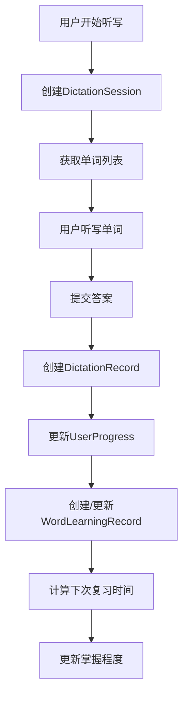
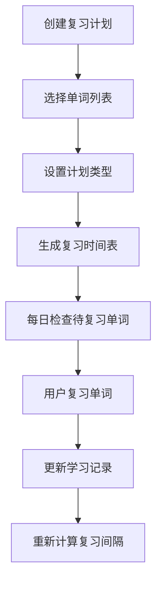

# EWord 数据库结构分析文档

## 概述

EWord是一个基于Django开发的背单词软件，使用SQLite作为数据库。本文档详细分析了数据库的表结构、关系设计、数据流程和查询优化建议，为开发人员、运维人员和数据分析人员提供参考。

## 数据库基本信息

- **数据库类型**: SQLite 3
- **数据库文件**: `db.sqlite3`
- **文件大小**: 264KB (当前状态)
- **Django版本**: 5.2.4
- **字符编码**: UTF-8

## 表结构分析

### 1. 单词管理相关表

#### 1.1 vocabulary_word (单词表)
**功能**: 存储所有单词的基本信息

| 字段名 | 类型 | 长度 | 是否为空 | 默认值 | 说明 |
|--------|------|------|----------|--------|------|
| id | INTEGER | - | NOT NULL | AUTO_INCREMENT | 主键 |
| word | VARCHAR | 100 | NOT NULL | - | 单词内容，唯一 |
| phonetic | VARCHAR | 100 | NULL | '' | 音标 |
| translation | TEXT | - | NOT NULL | - | 中文释义 |
| example_sentence | TEXT | - | NULL | '' | 例句 |
| difficulty_level | INTEGER | - | NOT NULL | 1 | 难度等级(1:简单,2:中等,3:困难) |
| created_at | DATETIME | - | NOT NULL | CURRENT_TIMESTAMP | 创建时间 |
| updated_at | DATETIME | - | NOT NULL | CURRENT_TIMESTAMP | 更新时间 |
| is_active | BOOLEAN | - | NOT NULL | 1 | 是否启用 |

**索引**:
- PRIMARY KEY (id)
- UNIQUE (word)

**数据示例**:
```sql
INSERT INTO vocabulary_word (word, phonetic, translation, difficulty_level) 
VALUES ('apple', '[ˈæpl]', '苹果', 1);
```

#### 1.2 vocabulary_wordlist (单词列表表)
**功能**: 管理单词列表，支持创建不同的词书

| 字段名 | 类型 | 长度 | 是否为空 | 默认值 | 说明 |
|--------|------|------|----------|--------|------|
| id | INTEGER | - | NOT NULL | AUTO_INCREMENT | 主键 |
| name | VARCHAR | 200 | NOT NULL | - | 列表名称 |
| description | TEXT | - | NULL | '' | 描述 |
| created_at | DATETIME | - | NOT NULL | CURRENT_TIMESTAMP | 创建时间 |
| updated_at | DATETIME | - | NOT NULL | CURRENT_TIMESTAMP | 更新时间 |

**索引**:
- PRIMARY KEY (id)

#### 1.3 vocabulary_wordlistword (单词列表关联表)
**功能**: 实现单词与单词列表的多对多关系，支持排序

| 字段名 | 类型 | 长度 | 是否为空 | 默认值 | 说明 |
|--------|------|------|----------|--------|------|
| id | INTEGER | - | NOT NULL | AUTO_INCREMENT | 主键 |
| word_list_id | INTEGER | - | NOT NULL | - | 单词列表ID (外键) |
| word_id | INTEGER | - | NOT NULL | - | 单词ID (外键) |
| order | INTEGER | - | NOT NULL | 0 | 排序字段 |
| added_at | DATETIME | - | NOT NULL | CURRENT_TIMESTAMP | 添加时间 |

**索引**:
- PRIMARY KEY (id)
- UNIQUE (word_list_id, word_id)
- INDEX (order)

### 2. 用户学习记录相关表

#### 2.1 vocabulary_wordlearningrecord (单词学习记录表)
**功能**: 跟踪用户对每个单词的学习进度，基于艾宾浩斯遗忘曲线

| 字段名 | 类型 | 长度 | 是否为空 | 默认值 | 说明 |
|--------|------|------|----------|--------|------|
| id | INTEGER | - | NOT NULL | AUTO_INCREMENT | 主键 |
| word_id | INTEGER | - | NOT NULL | - | 单词ID (外键) |
| user_id | INTEGER | - | NOT NULL | - | 用户ID (外键) |
| first_learn_date | DATETIME | - | NOT NULL | CURRENT_TIMESTAMP | 首次学习时间 |
| last_review_date | DATETIME | - | NOT NULL | CURRENT_TIMESTAMP | 最后复习时间 |
| review_count | INTEGER | - | NOT NULL | 0 | 复习次数 |
| mastery_level | INTEGER | - | NOT NULL | 0 | 掌握程度(0-100) |
| next_review_date | DATETIME | - | NOT NULL | - | 下次复习时间 |

**索引**:
- PRIMARY KEY (id)
- UNIQUE (word_id, user_id)
- INDEX (next_review_date)
- INDEX (mastery_level)

**艾宾浩斯遗忘曲线复习间隔**:
```python
intervals = [1, 2, 4, 7, 15, 30, 60, 90]  # 复习间隔(天)
```

#### 2.2 vocabulary_reviewplan (复习计划表)
**功能**: 管理用户的复习计划

| 字段名 | 类型 | 长度 | 是否为空 | 默认值 | 说明 |
|--------|------|------|----------|--------|------|
| id | INTEGER | - | NOT NULL | AUTO_INCREMENT | 主键 |
| user_id | INTEGER | - | NOT NULL | - | 用户ID (外键) |
| word_list_id | INTEGER | - | NOT NULL | - | 单词列表ID (外键) |
| created_date | DATETIME | - | NOT NULL | CURRENT_TIMESTAMP | 创建时间 |
| start_date | DATETIME | - | NOT NULL | - | 开始时间 |
| is_active | BOOLEAN | - | NOT NULL | 1 | 是否活跃 |
| plan_type | VARCHAR | 10 | NOT NULL | - | 计划类型(NEW:新学习,REVIEW:复习计划) |

**索引**:
- PRIMARY KEY (id)
- INDEX (user_id, is_active)

### 3. 听写功能相关表

#### 3.1 dictation_dictationsession (听写会话表)
**功能**: 记录每次听写练习的会话信息

| 字段名 | 类型 | 长度 | 是否为空 | 默认值 | 说明 |
|--------|------|------|----------|--------|------|
| id | INTEGER | - | NOT NULL | AUTO_INCREMENT | 主键 |
| word_list_id | INTEGER | - | NOT NULL | - | 单词列表ID (外键) |
| session_name | VARCHAR | 200 | NOT NULL | - | 会话名称 |
| total_words | INTEGER | - | NOT NULL | 0 | 总单词数 |
| completed_words | INTEGER | - | NOT NULL | 0 | 已完成单词数 |
| correct_count | INTEGER | - | NOT NULL | 0 | 正确数量 |
| wrong_count | INTEGER | - | NOT NULL | 0 | 错误数量 |
| start_time | DATETIME | - | NOT NULL | CURRENT_TIMESTAMP | 开始时间 |
| end_time | DATETIME | - | NULL | - | 结束时间 |
| is_completed | BOOLEAN | - | NOT NULL | 0 | 是否完成 |
| user_id | INTEGER | - | NULL | - | 用户ID (外键) |

**索引**:
- PRIMARY KEY (id)
- INDEX (user_id, is_completed)
- INDEX (start_time)

**计算字段**:
- `accuracy_rate`: 准确率 = (correct_count / total_words) * 100
- `duration`: 持续时间 = end_time - start_time

#### 3.2 dictation_dictationrecord (听写记录表)
**功能**: 记录每次听写的详细结果

| 字段名 | 类型 | 长度 | 是否为空 | 默认值 | 说明 |
|--------|------|------|----------|--------|------|
| id | INTEGER | - | NOT NULL | AUTO_INCREMENT | 主键 |
| session_id | INTEGER | - | NOT NULL | - | 听写会话ID (外键) |
| word_id | INTEGER | - | NOT NULL | - | 单词ID (外键) |
| user_answer | VARCHAR | 100 | NOT NULL | - | 用户答案 |
| is_correct | BOOLEAN | - | NOT NULL | 0 | 是否正确 |
| time_taken | INTEGER | - | NOT NULL | 0 | 用时(秒) |
| created_at | DATETIME | - | NOT NULL | CURRENT_TIMESTAMP | 创建时间 |
| learning_record_id | INTEGER | - | NULL | - | 学习记录ID (外键) |

**索引**:
- PRIMARY KEY (id)
- INDEX (session_id)
- INDEX (word_id)
- INDEX (is_correct)

#### 3.3 dictation_userprogress (用户进度表)
**功能**: 跟踪用户对每个单词的总体学习进度

| 字段名 | 类型 | 长度 | 是否为空 | 默认值 | 说明 |
|--------|------|------|----------|--------|------|
| id | INTEGER | - | NOT NULL | AUTO_INCREMENT | 主键 |
| word_id | INTEGER | - | NOT NULL | - | 单词ID (外键) |
| word_id | INTEGER | - | NOT NULL | - | 单词ID (外键) |
| total_attempts | INTEGER | - | NOT NULL | 0 | 总尝试次数 |
| correct_attempts | INTEGER | - | NOT NULL | 0 | 正确次数 |
| last_practiced | DATETIME | - | NOT NULL | CURRENT_TIMESTAMP | 最后练习时间 |
| mastery_level | INTEGER | - | NOT NULL | 0 | 掌握程度(0-4) |

**索引**:
- PRIMARY KEY (id)
- INDEX (word_id)
- INDEX (mastery_level)

**掌握程度计算**:
```python
accuracy = (correct_attempts / total_attempts) * 100
if accuracy >= 90: mastery_level = 4
elif accuracy >= 80: mastery_level = 3
elif accuracy >= 60: mastery_level = 2
elif accuracy >= 30: mastery_level = 1
else: mastery_level = 0
```

### 4. Django系统表

#### 4.1 auth_user (用户表)
**功能**: Django内置用户认证表

| 字段名 | 类型 | 长度 | 是否为空 | 默认值 | 说明 |
|--------|------|------|----------|--------|------|
| id | INTEGER | - | NOT NULL | AUTO_INCREMENT | 主键 |
| password | VARCHAR | 128 | NOT NULL | - | 密码哈希 |
| last_login | DATETIME | - | NULL | - | 最后登录时间 |
| is_superuser | BOOLEAN | - | NOT NULL | 0 | 是否超级用户 |
| username | VARCHAR | 150 | NOT NULL | - | 用户名，唯一 |
| first_name | VARCHAR | 150 | NOT NULL | - | 名 |
| last_name | VARCHAR | 150 | NOT NULL | - | 姓 |
| email | VARCHAR | 254 | NOT NULL | - | 邮箱 |
| is_staff | BOOLEAN | - | NOT NULL | 0 | 是否员工 |
| is_active | BOOLEAN | - | NOT NULL | 1 | 是否激活 |
| date_joined | DATETIME | - | NOT NULL | CURRENT_TIMESTAMP | 注册时间 |

## 表关系图

```
auth_user (用户)
    ↓ 1:N
vocabulary_wordlearningrecord (学习记录)
    ↓ N:1
vocabulary_word (单词)
    ↓ N:M
vocabulary_wordlist (单词列表)
    ↓ 通过 vocabulary_wordlistword (关联表)

vocabulary_reviewplan (复习计划)
    ↓ N:1
vocabulary_wordlist (单词列表)
    ↓ N:1
auth_user (用户)

dictation_dictationsession (听写会话)
    ↓ 1:N
dictation_dictationrecord (听写记录)
    ↓ N:1
vocabulary_word (单词)
    ↓ N:1
dictation_userprogress (用户进度)
```

## 数据流程分析

### 1. 单词学习流程



### 2. 复习计划流程



## 查询优化建议

### 1. 常用查询索引

```sql
-- 获取用户今日待复习单词
CREATE INDEX idx_wordlearning_user_nextreview 
ON vocabulary_wordlearningrecord(user_id, next_review_date);

-- 获取用户听写历史
CREATE INDEX idx_dictationsession_user_completed 
ON dictation_dictationsession(user_id, is_completed, start_time);

-- 获取单词掌握程度分布
CREATE INDEX idx_wordlearning_mastery 
ON vocabulary_wordlearningrecord(mastery_level);
```

### 2. 性能优化查询

```sql
-- 获取用户学习统计（使用JOIN优化）
SELECT 
    u.username,
    COUNT(DISTINCT wlr.word_id) as total_words,
    AVG(wlr.mastery_level) as avg_mastery,
    COUNT(CASE WHEN wlr.mastery_level >= 80 THEN 1 END) as mastered_words
FROM auth_user u
LEFT JOIN vocabulary_wordlearningrecord wlr ON u.id = wlr.user_id
WHERE u.is_active = 1
GROUP BY u.id, u.username;

-- 获取听写准确率趋势（使用窗口函数）
SELECT 
    DATE(ds.start_time) as practice_date,
    AVG(ds.correct_count * 100.0 / ds.total_words) as avg_accuracy,
    COUNT(*) as session_count
FROM dictation_dictationsession ds
WHERE ds.is_completed = 1
GROUP BY DATE(ds.start_time)
ORDER BY practice_date;
```

## 数据备份和恢复

### 1. 备份策略

```bash
# 完整备份
sqlite3 db.sqlite3 ".backup backup_$(date +%Y%m%d_%H%M%S).db"

# 导出数据
sqlite3 db.sqlite3 ".dump" > backup_$(date +%Y%m%d_%H%M%S).sql
```

### 2. 数据清理

```sql
-- 清理过期的听写会话（保留30天）
DELETE FROM dictation_dictationsession 
WHERE start_time < datetime('now', '-30 days') 
AND is_completed = 1;

-- 清理无效的学习记录
DELETE FROM vocabulary_wordlearningrecord 
WHERE user_id NOT IN (SELECT id FROM auth_user WHERE is_active = 1);
```

## 数据分析建议

### 1. 学习效果分析

```sql
-- 用户学习进度分析
SELECT 
    mastery_level,
    COUNT(*) as word_count,
    ROUND(COUNT(*) * 100.0 / SUM(COUNT(*)) OVER(), 2) as percentage
FROM vocabulary_wordlearningrecord
WHERE user_id = ? 
GROUP BY mastery_level
ORDER BY mastery_level;
```

### 2. 听写表现分析

```sql
-- 难度级别表现分析
SELECT 
    w.difficulty_level,
    COUNT(*) as total_attempts,
    SUM(CASE WHEN dr.is_correct THEN 1 ELSE 0 END) as correct_attempts,
    ROUND(SUM(CASE WHEN dr.is_correct THEN 1 ELSE 0 END) * 100.0 / COUNT(*), 2) as accuracy_rate
FROM dictation_dictationrecord dr
JOIN vocabulary_word w ON dr.word_id = w.id
WHERE dr.session_id IN (SELECT id FROM dictation_dictationsession WHERE user_id = ?)
GROUP BY w.difficulty_level
ORDER BY w.difficulty_level;
```

## 维护建议

### 1. 定期维护任务

- **每日**: 检查数据库文件大小和完整性
- **每周**: 分析慢查询日志，优化索引
- **每月**: 清理过期数据，更新统计信息
- **每季度**: 完整备份和恢复测试

### 2. 监控指标

- 数据库文件大小增长趋势
- 查询响应时间
- 并发用户数
- 数据一致性检查

### 3. 扩展性考虑

- 考虑迁移到PostgreSQL以支持更复杂的查询
- 实现读写分离以提高性能
- 使用Redis缓存热点数据
- 考虑分表策略以应对大量数据

---

**文档版本**: 1.0  
**最后更新**: 2024年12月  
**维护人员**: 开发团队
